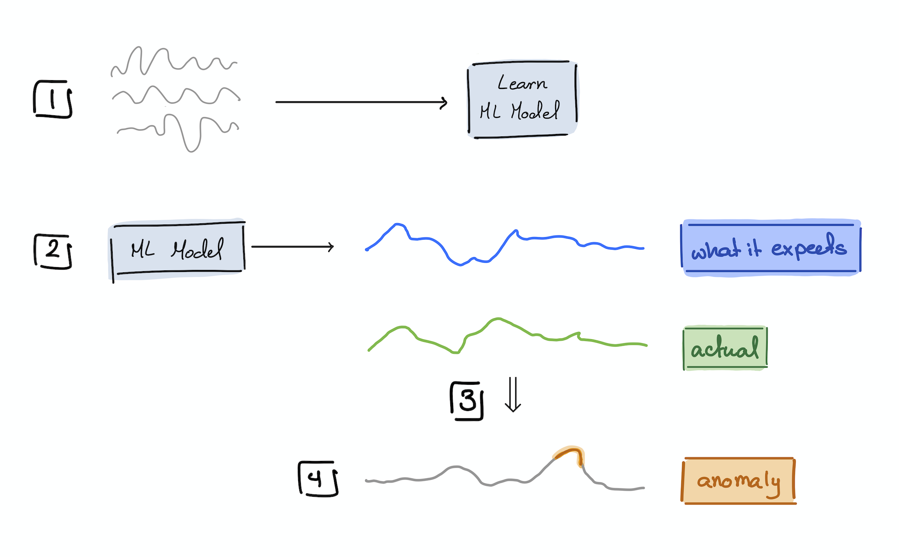
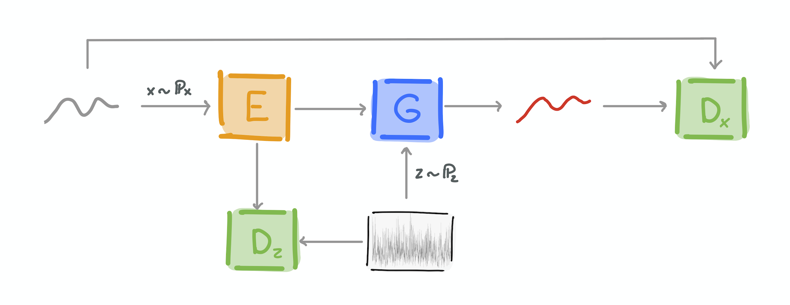
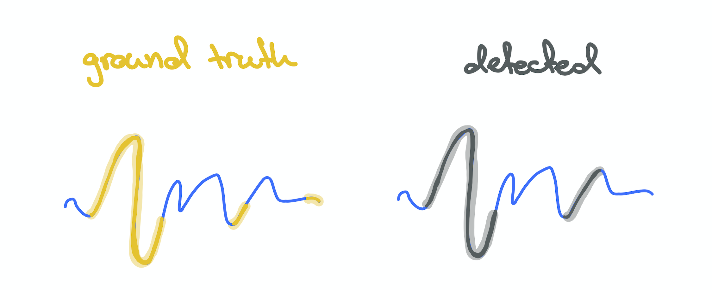

<p align="left">

<i>An open source project from Data to AI Lab at MIT.</i>
</p>

<p align="left">

</p>

[](https://pypi.org/search/?c=Development+Status+%3A%3A+2+-+Pre-Alpha)
[](https://pypi.python.org/pypi/orion-ml)
[](https://github.com/signals-dev/Orion/actions?query=workflow%3A%22Run+Tests%22+branch%3Amaster)
[](https://pepy.tech/project/orion-ml)
[](https://mybinder.org/v2/gh/signals-dev/Orion/master?filepath=notebooks)

# Orion

* License: [MIT](https://github.com/signals-dev/Orion/blob/master/LICENSE)
* Development Status: [Pre-Alpha](https://pypi.org/search/?c=Development+Status+%3A%3A+2+-+Pre-Alpha)
* Homepage: https://github.com/signals-dev/Orion
* Documentation: https://signals-dev.github.io/Orion

# Overview

Orion is a machine learning library built for *unsupervised time series anomaly detection*. With a given time series data, we provide a number of “verified” ML pipelines (a.k.a Orion pipelines) that identify rare patterns and flag them for expert review.

The library makes use of a number of **automated machine learning** tools developed under [Data to AI Lab at MIT](https://dai.lids.mit.edu/).

**Recent news:** Read about using an Orion pipeline on NYC taxi dataset in a blog series:

[Part 1: Learn about unsupervised time series anomaly detection](https://t.co/yIFVM1oRwQ?amp=1) | [Part 2: Learn how we use GANs to solving the problem? ](https://link.medium.com/cGsBD0Fevbb) | [Part 3: How does one evaluate anomaly detection pipelines?](https://link.medium.com/FqCrFXMevbb)
:--------------------------------------:|:---------------------------------------------:|:--------------------------------------------:
       |              | 

**Notebooks:** Discover *Orion* through colab by launching our [notebooks](https://drive.google.com/drive/folders/1FAcCEiE1JDsqaMjGcmiw5a5XuGh13c9Q?usp=sharing)!

# Quickstart

## Install with pip

The easiest and recommended way to install **Orion** is using [pip](https://pip.pypa.io/en/stable/):

```bash
pip install orion-ml
```

This will pull and install the latest stable release from [PyPi](https://pypi.org/).


In the following example we show how to use one of the **Orion Pipelines**.

## Fit an Orion pipeline

We will load a demo data for this example:

```python3
from orion.data import load_signal

train_data = load_signal('S-1-train')
train_data.head()
```

which should show a signal with `timestamp` and `value`.
```
    timestamp     value
0  1222819200 -0.366359
1  1222840800 -0.394108
2  1222862400  0.403625
3  1222884000 -0.362759
4  1222905600 -0.370746
```

In this example we use `lstm_dynamic_threshold` pipeline and set some hyperparameters (in this case training epochs as 5).

```python3
from orion import Orion

hyperparameters = {
    'keras.Sequential.LSTMTimeSeriesRegressor#1': {
        'epochs': 5,
        'verbose': True
    }
}

orion = Orion(
    pipeline='lstm_dynamic_threshold',
    hyperparameters=hyperparameters
)

orion.fit(train_data)
```

## Detect anomalies using the fitted pipeline
Once it is fitted, we are ready to use it to detect anomalies in our incoming time series:

```python3
new_data = load_signal('S-1-new')
anomalies = orion.detect(new_data)
```
> :warning: Depending on your system and the exact versions that you might have installed some *WARNINGS* may be printed. These can be safely ignored as they do not interfere with the proper behavior of the pipeline.

The output of the previous command will be a ``pandas.DataFrame`` containing a table of detected anomalies:

```
        start         end  severity
0  1394323200  1399701600  0.673494
```

# Leaderboard
In every release, we run Orion benchmark. We maintain an up-to-date leaderboard with the current scoring of the verified pipelines according to the benchmarking procedure.

We run the benchmark on **11** datasets with their known grounth truth. We record the score of the pipelines on each datasets. To compute the leaderboard table, we showcase the number of wins each pipeline has over the ARIMA pipeline.

| Pipeline                  |  Outperforms ARIMA |
|---------------------------|--------------------|
| TadGAN                    |          7         |
| LSTM Dynamic Thresholding |          5         |
| Azure                     |          0         |

You can find the scores of each pipeline on every signal recorded in the [details Google Sheets document](https://docs.google.com/spreadsheets/d/1HaYDjY-BEXEObbi65fwG0om5d8kbRarhpK4mvOZVmqU/edit?usp=sharing). The summarized results can also be browsed in the following [summary Google Sheets document](https://docs.google.com/spreadsheets/d/1ZPUwYH8LhDovVeuJhKYGXYny7472HXVCzhX6D6PObmg/edit?usp=sharing).

# Resources

Additional resources that might be of interest:
* Learn about [benchmarking pipelines](BENCHMARK.md).
* Read about [pipeline evaluation](orion/evaluation/README.md).
* More about [database design](DATABASE.md).
* Find out more about [TadGAN](https://arxiv.org/pdf/2009.07769v3.pdf).

# Citation

If you use **Orion** for your research, please consider citing the following paper:

Alexander Geiger, Dongyu Liu, Sarah Alnegheimish, Alfredo Cuesta-Infante, Kalyan Veeramachaneni. [TadGAN - Time Series Anomaly Detection Using Generative Adversarial Networks](https://arxiv.org/pdf/2009.07769v3.pdf).

```
@inproceedings{geiger2020tadgan,
  title={TadGAN: Time Series Anomaly Detection Using Generative Adversarial Networks},
  author={Geiger, Alexander and Liu, Dongyu and Alnegheimish, Sarah and Cuesta-Infante, Alfredo and Veeramachaneni, Kalyan},
  booktitle={2020 IEEE International Conference on Big Data (IEEE BigData)},
  organization={IEEE},
  year={2020}
}
```
